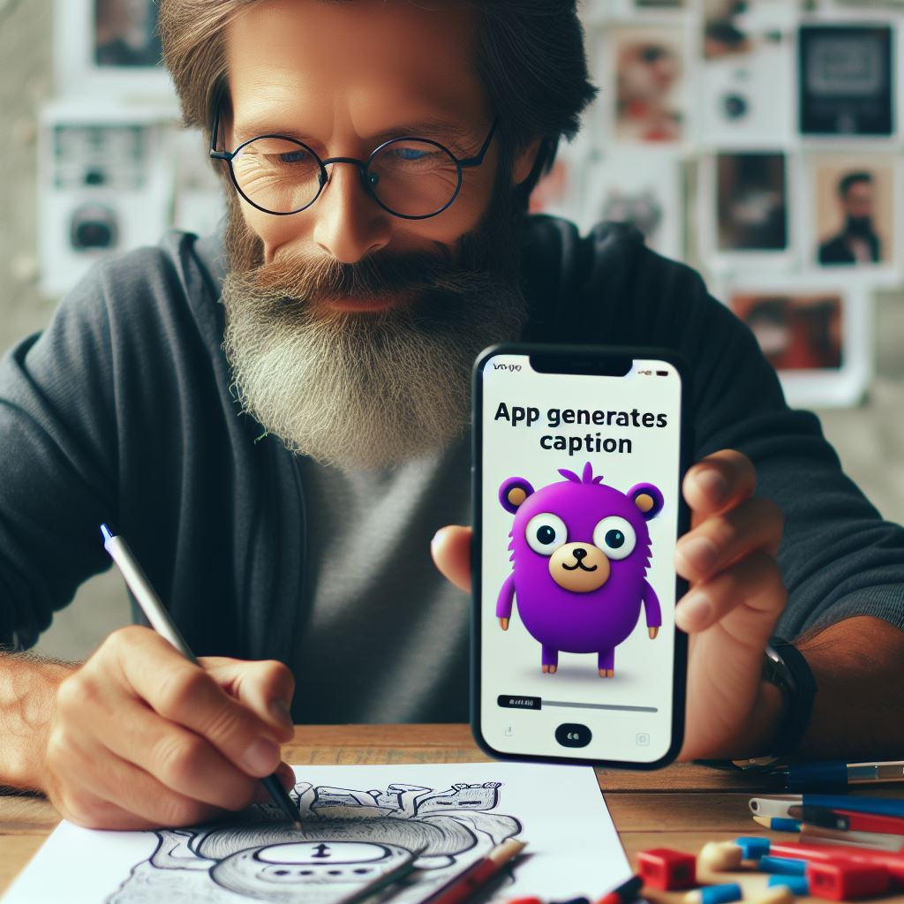
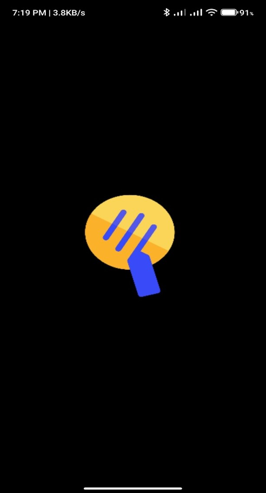
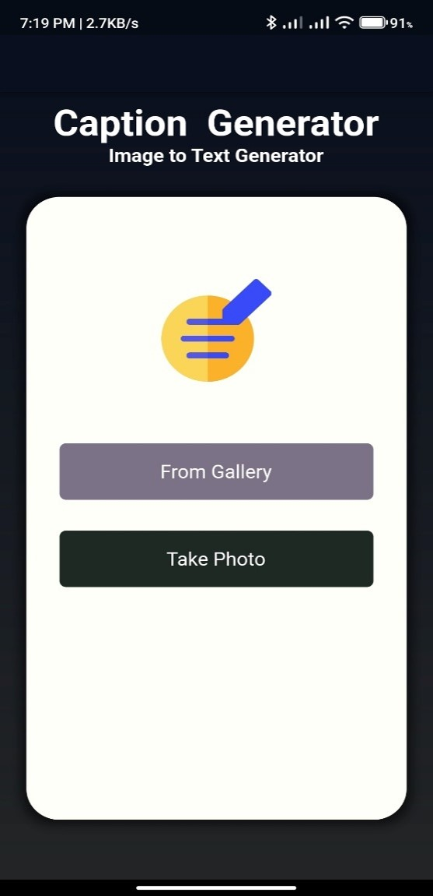
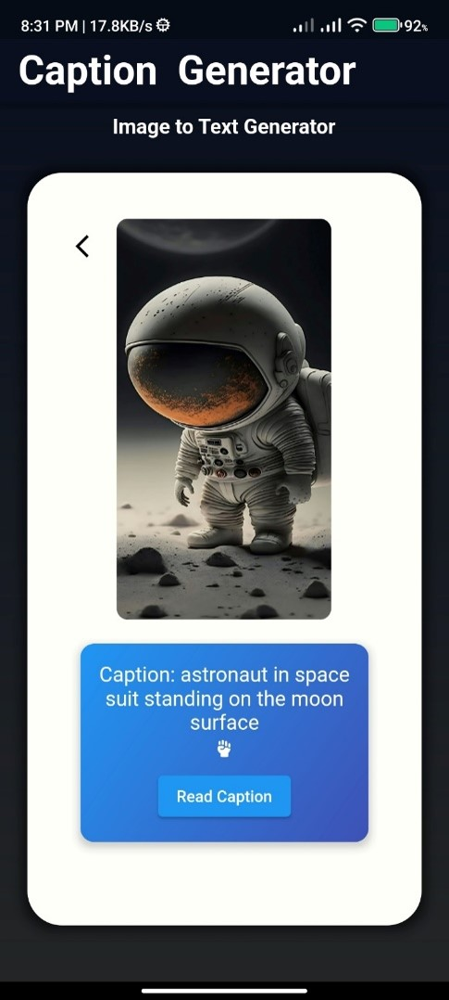

# Caption Generator Application


[](https://img.shields.io/github/v/release/navendu-pottekkat/awesome-readme?include_prereleases)
[](https://img.shields.io/github/last-commit/navendu-pottekkat/awesome-readme)
[](https://img.shields.io/github/issues-raw/navendu-pottekkat/awesome-readme)
[](https://img.shields.io/github/issues-pr/navendu-pottekkat/awesome-readme)
[](https://img.shields.io/github/license/navendu-pottekkat/awesome-readme)


## Introduction
The **Caption Generator Application** is a machine learning-based solution designed to generate accurate, informative captions for images. This application is:
- **User-friendly** and accessible to a wide range of users, including those with visual impairments.
- **Context-aware**, capable of providing additional insights about the image.


---

## Motivation
The motivation behind this project is:
- To enable easy and accurate caption generation for images.
- To ensure the application is accessible to everyone, especially visually impaired users.
- To maintain security and reliability throughout the system.

---

## Project Overview

### 1. Splash Screen
The application begins with a splash screen for an engaging introduction.



### 2. Home Page
The home page serves as the main navigation point for users.



### 3. Caption Generation Page
This page allows users to upload images and generates descriptive captions for them.


### 4. Text-to-Voice
- The application converts generated captions to speech.
- This feature is especially beneficial for blind users.



---

## Objectives
- To generate **accurate and descriptive captions** for images.
- To provide a **user-friendly interface** that enhances usability.
- To offer **informative captions** that improve understanding of images.

---

## System Implementation
The system implementation consists of the following steps:
1. **Data Preparation**: Collecting and preprocessing image-caption datasets.
2. **Model Development**: Using advanced machine learning models for caption generation.
3. **Flutter App Integration**: Seamless integration of the model into a Flutter-based application.
4. **App Implementation**: Developing the application with focus on accessibility.
5. **Testing**: Ensuring the application meets performance and usability standards.


---

## Conclusion
The Caption Generator Application integrates advanced machine learning models into a user-friendly Flutter application. It aims to:
- Enhance human-computer interaction through meaningful image captions.
- Promote accessibility and inclusivity.

**Note**: Currently, the application supports only the English language.

---

## Tech Stack

### **Software**
- VS Code
- Google Chrome
- Git
- Postman
- MongoDB Compass

### **Languages & Frameworks**
- Python (for model development)
- Flutter (for app development)
- TensorFlow/Keras

---

## Installation and Setup
1. Clone the repository:
   ```bash
   git clone https://github.com/your-username/caption-generator.git
   ```
2. Navigate to the project directory:
   ```bash
   cd caption-generator
   ```
3. Install dependencies:
   ```bash
   pip install -r requirements.txt
   ```
4. Run the application:
   ```bash
   flutter run
   ```

---

## Contributing
We welcome contributions to improve the Caption Generator Application! Please follow these steps:
1. Fork the repository.
2. Create a new branch for your feature:
   ```bash
   git checkout -b feature-name
   ```
3. Commit your changes:
   ```bash
   git commit -m "Add feature-name"
   ```
4. Push the branch:
   ```bash
   git push origin feature-name
   ```
5. Open a pull request and provide a detailed description.

---

## License
This project is licensed under the [MIT License](./LICENSE).

---

Thank you for exploring the **Caption Generator Application**! 🌟
